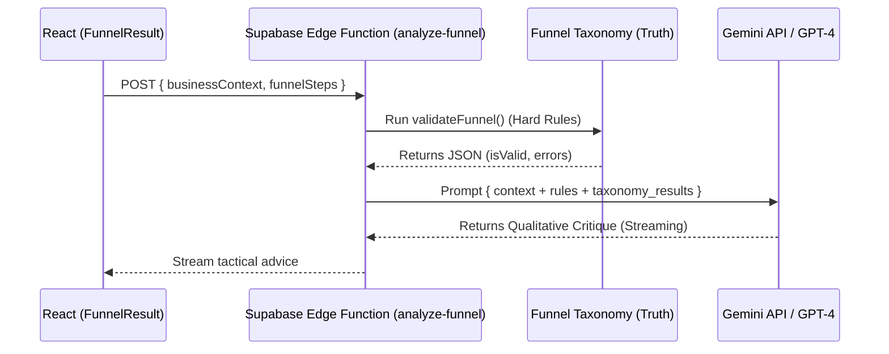

# Implementation Plan: Strategic AI Advisor (Phase 6)

## Goal
To elevate "The Funnel Inspector" from a rule-based validator to a qualitative strategic coach using LLM-powered critiques.

## Proposed Changes

### [Technical Architecture]

#### AI Diagnostic Flow

### [Components]

#### [NEW] [analyze-funnel](file:///Users/md.rashedmamun/Claude Code Projects/Antigravity Venture Studio/smb-coaching-ai/supabase/functions/analyze-funnel/index.ts)
A new Supabase Edge Function that:
1. Receives the `BusinessContext`.
2. Injects the `Funnel Taxonomy` output as "Deterministic Evidence."
3. Prompts the LLM to provide a "Semantic Audit."

#### [NEW] [advisor_prompts.md](file:///Users/md.rashedmamun/.gemini/antigravity/brain/49f322ea-9197-47f8-8070-70aa4e3beecd/advisor_prompts.md)
A library of modular prompt parts to avoid "Generic Advice."
- **Anchor:** "You are an SMB growth coach following a proprietary high-ticket methodology."
- **Rules:** "Never suggest paid ads for Stage 0. Never allow high friction on cold traffic."
- **Few-Shot:** Examples of turning bad funnel copy into winning copy.

#### [MODIFY] [FunnelResult.tsx](file:///Users/md.rashedmamun/Claude Code Projects/Antigravity Venture Studio/smb-coaching-ai/src/components/modules/Module2/FunnelResult.tsx)
Integrate the AI response:
- Add an `AICritique` component with a typewriter effect.
- Handle loading/streaming states.

---

## Verification Plan

### Automated Testing
Use the **Agent Testing Framework** to verify that the AI Auditor correctly identifies when the Strategic AI Advisor makes a methodology mistake.

### [FORK] The Model Fork (Phase 7.1)
To protect the integrity of our "High-Ticket Service" logic, we will introduce a **Strategic Fork** at the very beginning of the Intake.

#### The Qualifying Question:
"Are you selling a **High-Ticket Service**?" 
- *Definition:* You sell a service (Agency, Coaching, Consulting) where a single client is worth >$2,000 and typically requires a conversation to close.

#### The Bifurcation:
1.  **Track A: The High-Ticket Engine:** The current flow persists. All diagnostics, scoring, and "Marriage on First Date" rules apply.
2.  **Track B: The Commodity Engine (Low-Touch/SaaS):** A separate, simplified diagnostic track. 
    - *No Sales Call requirement.*
    - *Focus on "Conversion Rate" and "Ad Spend Efficiency" instead of "Friction."*

#### Technical Implementation:
- Update `BusinessContext` to store `isHighTicketService: boolean`.
- Use this flag to toggle which `funnel_taxonomy` rules are active.
